<div align="center">



<br/>

[](src/)
[](build_monster.sh)
[](Cargo.toml)
[](start.S)
[](sov_monster_kernel.f90)
[](lean/)
[](LICENSE)
[](LICENSE#part-ix--prior-art-preservation)

</div>

---

> **The Monster doesn't run on infrastructure. The Monster *is* the infrastructure.**

SOV-KERNEL-MONSTER is the sovereign quantum compute kernel. It evolves density matrices under a Hamiltonian, attests every output with Blake3 + Ed25519, and compiles to bare metal — ARM64 SVE2, x86-64 AVX-512, NVIDIA PTX — with zero runtime dependencies. No libc. No BLAS. No crypto libraries. Pure Fortran 2018 + MLIR.

---

## Architecture

```
┌─────────────────────────────────────────────────────────────────────────┐
│                         SOV-KERNEL-MONSTER                              │
├─────────────────────────────────────────────────────────────────────────┤
│  SPEC     Lean 4          @[extern] FFI bindings → sov_* C ABI         │
│  KERNEL   Fortran 2018    sov_monster_kernel.f90  1506 lines            │
│           boolean_spectral_lens.f90                296 lines            │
│           measurement_head.f90                     305 lines            │
│           jordan_block.f90                         284 lines            │
│           spe_encoder.f90                          444 lines            │
│           training_adjoint.f90                     354 lines            │
│           bob_kinds / state / gates / lattice / metrics                 │
│           bob_hamiltonian / integrator / measurement / rng / abi        │
│                                                    4224 lines            │
│  CONTROL  C--             sov_control.cmm   state machine loop         │
│  FUSION   MLIR            sov_pipeline.mlir polyhedral linalg fusion   │
│  BACKEND  LLVM            ARM64 SVE2 · x86_64 AVX-512 · PTX · SPIR-V  │
│  RUNTIME  Assembly        start.S  bare entry, no libc, no crt0        │
│  ATTEST   Blake3+Ed25519  .note.sov ELF section, every output sealed   │
│  BROWSER  WASM            quantum-wasm/src/lib.rs  JS fallback          │
│  GAME     HTML            vortex_doom_quantum.html  zero deps           │
└─────────────────────────────────────────────────────────────────────────┘
```

## Data Flow

```
INPUT   H ∈ ℂⁿˣⁿ (Hermitian)   ρ ∈ ℂⁿˣⁿ (density matrix)   dt   sk   pk
         │
         ▼
┌────────────────────┐
│  PLASMA PRE-FLIGHT │  sov_plasma_verify — H Hermitian? ρ density? shapes valid?
│  sov_plasma_verify │  Blake3 hash of input. sov_fault on any failure.
└────────┬───────────┘
         │ PASS
         ▼
┌────────────────────┐
│  MATRIX EXPONENTIAL│  U = exp(−i·dt·H)   Padé-13 + scaling & squaring
│  sov_zmexp_        │  No LAPACK. LU: sov_zgetrf. Solve: sov_zgetrs.
│  scaling_squaring  │
└────────┬───────────┘
         │
         ▼
┌────────────────────┐
│  TIME EVOLUTION    │  ρ(t+dt) = U · ρ(t) · U†   fused ZGEMM
│  sov_apl_step_     │  OpenACC/OpenMP parallel. AVX-512 auto-vectorized.
│  zgemm_fused       │
└────────┬───────────┘
         │
         ▼
┌────────────────────┐
│  MEASUREMENT HEAD  │  Born rule: p_j = tr(q_j ρ)
│  born_rule         │  Fibonacci temperature: τ_k = φ⁻ᵏ
│  born_rule_        │  APL: p ← *p ÷ +/*p   (softmax in one line)
│  temperature       │
└────────┬───────────┘
         │
         ▼
┌────────────────────┐
│  BLAKE3 ATTESTATION│  Hash(output ‖ input ‖ timestamp) → 32-byte digest
│  sov_bifrost_sign  │  Ed25519 signature → baked into .note.sov ELF section
│  sov_bifrost_verify│  Every output is cryptographically sealed. Forever.
└────────┬───────────┘
         │
         ▼
OUTPUT  ρ(t+dt)   SHA-256 hash   Ed25519 signature   receipt
```

## Modules

### `sov_monster_kernel.f90` — 1506 lines

| Function | Description |
|---|---|
| `sov_plasma_verify` | Pre-flight Hermiticity + trace-1 check with Blake3 hash |
| `sov_bifrost_sign` | Ed25519 signature of payload |
| `sov_bifrost_verify` | Ed25519 verification |
| `sov_apl_step_zgemm_fused` | Fused U·ρ·U† with inline attestation |
| `sov_apl_evolve_sequence` | N-step sequence with per-step sealing |
| `sov_zmexp_scaling_squaring` | Matrix exponential via Padé-13 |
| `sov_blake3_init/update/finalize` | Pure Fortran BLAKE3 |
| `sov_zgetrf / sov_zgetrs` | LU factorization and solve, no LAPACK |

### `measurement_head.f90` — 305 lines

| Function | Description |
|---|---|
| `born_rule` | p_j = tr(q_j ρ) — Born projections, APL: `+/ (q_j × ρ)` |
| `born_rule_temperature` | Softmax Born at Fibonacci temperature τ = φ⁻ᵏ |
| `argmax_spectral` | APL: `⍒p` — grade down to sharpest eigenvalue |
| `sample_spectral` | APL: `p ⌸ ⍳m` — sample from probability simplex |

### `boolean_spectral_lens.f90` — 296 lines

Jordan algebra of Hermitian matrices: TRUE = I, FALSE = 0, AND = A∘B = ½(AB+BA), XOR = A+B−2(A∘B). Inverted lens observes the whole (density matrix) through the part (eigenvalue). Full Lisp world dump as S-expressions for checkpoint.

### `jordan_block.f90` — 284 lines

| Function | Description |
|---|---|
| `jordan_step` | Single Trotter step with Blake3 attestation |
| `jordan_fib` | Fibonacci-scheduled multi-layer evolution |
| `jordan_fixpoint` | Fixed-point iteration with convergence check |
| `jordan_gradient` | Adjoint gradient for training |

### `bob_*.f90` — 4224 lines (11 modules)

The quantum physics substrate: `bob_kinds`, `bob_errors`, `bob_rng`, `bob_state`, `bob_gates`, `bob_lattice`, `bob_measurement`, `bob_hamiltonian`, `bob_integrator`, `bob_metrics`, `bob_abi`.

Implements: 8-qubit state vector (dim=256), 16×16 Josephson vortex lattice, Trotter evolution of Ising Hamiltonian H = −JΣσᶻᵢσᶻⱼ − hΣσˣᵢ, Born rule measurement with wavefunction collapse.

## Build

```bash
# Requires: flang-new-19, mlir-opt-19, llc-19, ld.lld-19

# With node key (sealed output)
SOV_SK=path/to/node_sk.bin ./build_monster.sh

# Dev mode (unsigned output, for local testing)
SOV_SK=dev ./build_monster.sh

# Outputs:
#   build/sov_monster_arm64   — ARM64 SVE2 static binary
#   build/sov_monster_x86     — x86-64 AVX-512 static binary
#   build/sov.ptx             — NVIDIA PTX
```

## Browser / WASM

No LLVM needed. The full quantum simulation runs in-browser:

```bash
# Build WASM (requires wasm-pack)
cd quantum-wasm && wasm-pack build --target web

# Open without building (JS fallback, identical math)
open vortex_doom_quantum.html
```

`vortex_doom_quantum.html` is a self-contained 799-line file. No npm. No server. Open it and the Monster is running in your GPU.

## The Game

`vortex_doom_quantum.html` — DOOM-style raycaster with the Monster's math as the physics engine:

- **BLAKE3 WORM** seals every game event (`sov_blake3_*`)
- **Born rule** (`born_rule_temperature`) selects which agent speaks each frame
- **Fibonacci temperature** τ = φ⁻ˢ controls sharpness vs entropy of agent dialogue
- **Plasma gate** (`sov_plasma_verify`) verifies state before evidence collection
- **Trotter evolution** runs Ising Hamiltonian every frame
- **Josephson coupling** drives the 16×16 vortex lattice
- **Topological charge** spawns and destroys SILENCE enemies
- Wall shading phase-shifted by quantum lattice at ray hit position
- Agent sprite size modulated by Born probability

Controls: `WASD`/arrows — move · `Space` — evidence pulse · `Q` — Hadamard all · `E` — measure q0 · `M` — WORM seal

## Prior Art

Mathematical derivations in this repository are recorded as Prior Art Entries PAR-001 through PAR-007 under the Sovereign Source License v3.0, Part IX:

| Entry | Subject | Date |
|---|---|---|
| PAR-001 | GKN I₄ quartic invariant on State56 (zero sorry, Lean 4) | 2026-06-01 |
| PAR-002 | I₄ homogeneity theorem (State108, degree-6) | 2026-06-01 |
| PAR-003 | E₇ Weyl group invariance of I₄ | 2026-06-01 |
| PAR-004 | Gates Normalization Constraint (softmax simplex) | 2026-07-18 |
| PAR-005 | Bifrost Attestation Protocol (Blake3 + Ed25519) | 2026-06-15 |
| PAR-006 | Plasma Gate Architecture (x86-64 + Datalog) | 2026-07-19 |
| PAR-007 | Fused U·ρ·U† kernel with inline attestation | 2026-07-19 |

## License

[Sovereign Source License v3.0](LICENSE) — Jessica (SNAPKITTYWEST) / Bel Esprit D'Accord Trust.

Not open source. Not MIT. Not Apache. **SSL v3.0.**

The Sovereign Substrate (mathematical primitives) is public domain under Part II. Formed works require attribution. Commercial use requires permission. AI/ML training is prohibited. Anti-misattribution enforcement is in Parts X–XI.

---

<div align="center">
<sub>Ω·III · EVIDENCE OR SILENCE · SOURCE = BINARY = PROOF · SOVEREIGN</sub>
</div>
