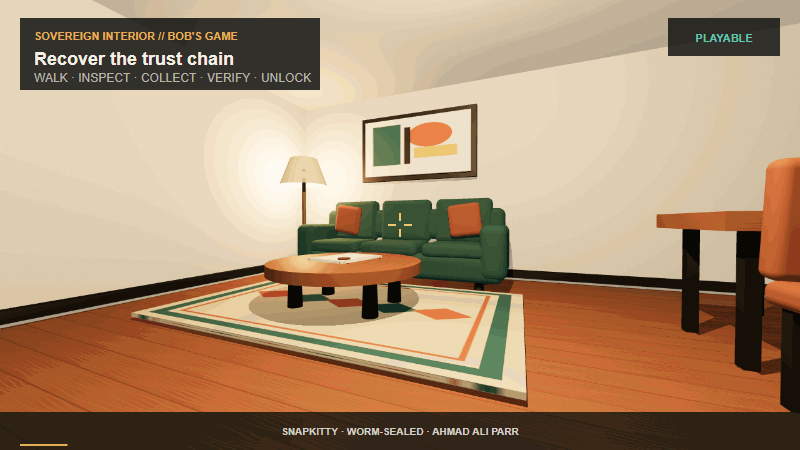

# Sovereign Interior

A WORM-sealed first-person chamber. Walk it. Verify the trust chain. Leave through the sealed door.

<div align="center">
<a href="https://snapkittywest.github.io/sov-kernel-monster/bobs-game/">

</a>
<br>
<strong><a href="https://snapkittywest.github.io/sov-kernel-monster/bobs-game/">PLAY SOVEREIGN INTERIOR</a></strong>
<br>
<sub>Three.js + Rapier3D · no install · runs in any browser</sub>
</div>

---

## QATAAUM State Machine

The game loop is the compiler loop. Same state machine. Same receipt chain.

```
                    ┌─────────────────────────────────────┐
                    │         QATAAUM COMPILER             │
     OpenQASM ──►  │  Parse → Validate → IR → Route       │
     Matrix   ──►  │                                       │
     Agent    ──►  │  ┌─────────────────────────────────┐ │
                    │  │        IR FAMILY (9 levels)      │ │
                    │  │  QASM → Gate → Pulse → Schedule  │ │
                    │  │  → Routing → Native → WORM       │ │
                    │  └──────────────┬──────────────────┘ │
                    └─────────────────┼───────────────────┘
                                      │
              ┌───────────────────────┼───────────────────────┐
              ▼                       ▼                        ▼
         Fortran                 ARM64/SVE2               WASM/Browser
         bare-metal              LLVM target              wasm-pack
              │                       │                        │
              └───────────────────────┼───────────────────────┘
                                      │
                          ┌───────────┴───────────┐
                          ▼                        ▼
                     RTX/CUDA              Haskell/AToKio
                     GPU target            agent runtime
                          │
                          ▼ (Phase 2)
                     IBM Quantum
                     hardware backend
                          │
                          ▼
              ┌───────────────────────────────────┐
              │       VERIFICATION BOUNDARY        │
              │  Lean 4 · Agda · Haskell types    │
              │  65+ theorems · 0 sorry            │
              └──────────────┬────────────────────┘
                             │
              ┌──────────────▼────────────────────┐
              │     CRYPTOGRAPHIC ATTESTATION      │
              │  Blake3 → Ed25519 → SovKangaroo    │
              └──────────────┬────────────────────┘
                             │
              ┌──────────────▼────────────────────┐
              │        WORM RECEIPT CHAIN          │
              │  RECEIPT₀ → RECEIPT₁ → RECEIPTₙ   │
              │  append-only · hash-linked         │
              └───────────────────────────────────┘
```

**The game seals every quest transition into this chain.** Inspect artwork → collect document → verify → activate terminal → exit. Each step is a receipt. The chain is identical in structure to a quantum circuit execution log.

---

## Quest State Machine

```
GENESIS
  │
  ▼
[INSPECT_ARTWORK]  ──► receipt_001 sealed
  │
  ▼
[COLLECT_DOCUMENT] ──► receipt_002 sealed
  │
  ▼
[VERIFY_EVIDENCE]  ──► receipt_003 sealed
  │
  ▼
[ACTIVATE_TERMINAL] ─► receipt_004 sealed
  │
  ▼
[UNLOCK_DOOR]      ──► receipt_005 sealed
  │
  ▼
[EXIT_CHAMBER]     ──► MISSION RECEIPT sealed
                       Blake3 hash · Ed25519 signed
```

Each receipt: `previousHash → payloadHash → stateHash → currentHash`

---

## Run

```bash
npm run dev
# open http://127.0.0.1:4173
```

No build step. Three.js and Rapier are pinned CDN modules.

Live: [snapkittywest.github.io/sov-kernel-monster/bobs-game](https://snapkittywest.github.io/sov-kernel-monster/bobs-game/)

## Test

```bash
npm test
```

Covers: quest ordering, authoritative state transitions, SHA-256 receipt chaining, tamper detection, save recovery, version rejection.

## Controls

| Action | Keys | Gamepad |
|--------|------|---------|
| Move | `WASD` / arrows | Left stick |
| Look | Mouse | Right stick |
| Interact | `E` | X / Square |
| Jump | `Space` | A / Cross |
| Sprint | `Shift` | Left-stick press |
| Crouch | `C` / `Ctrl` | B / Circle |
| Inventory | `I` / `Tab` | Y / Triangle |
| Pause | `Esc` / `P` | Menu |

Touch: movement stick, drag-to-look, action buttons.

## Architecture

| Layer | Module | Role |
|-------|--------|------|
| Core | `src/core/` | game loop, event bus, authoritative store, ledger, save/load |
| Physics | `src/physics/` | Rapier world, colliders, kinematic player, triggers |
| Player | `src/player/`, `src/input/` | camera rig, movement, gravity, stance |
| Interaction | `src/interaction/` | camera ray, metadata-driven object actions |
| Gameplay | `src/gameplay/` | inventory, quest conditions, item definitions |
| World | `src/world/`, `src/rendering/` | procedural level, PBR materials, lighting |
| Audio | `src/audio/` | footsteps, UI tones, positional lamp hum |
| UI | `src/ui/` | HUD, pause, inventory, document reader, completion |

Receipt chain is tamper-evident, not authenticated. Detects accidental edits — not a MAC or signature against a hostile client.
