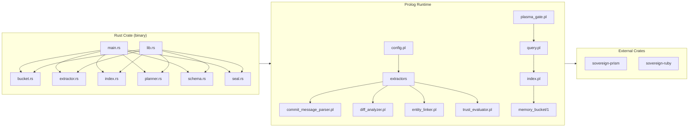
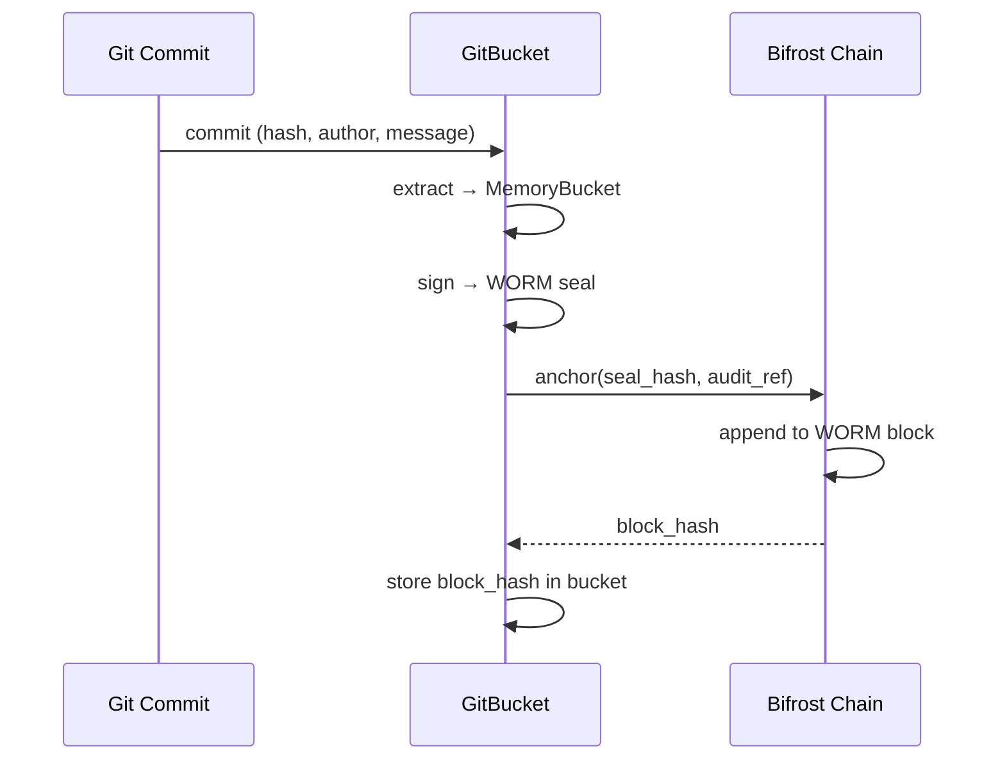

# SnapKitty GitBucket

> **Git as WORM, JSON as Query, Prolog as Truth**

Deterministic memory layer for sovereign compute stacks. Every git commit produces an immutable, WORM-sealed (Write-Once-Read-Many) memory bucket with Ed25519 cryptographic provenance. Rust binary CLI with a Prolog runtime for multi-dimensional indexing and proof-carrying queries.

```
╔══════════════════════════════════════════════════════════╗
║              SNAPKITTY GITBUCKET v0.1.0                  ║
║          DETERMINISTIC MEMORY LAYER FOR AGENT OS         ║
╠══════════════════════════════════════════════════════════╣
║  GIT  = WORM        Every commit is one immutable write  ║
║  JSON = QUERY       Buckets are JSON; query is indexing  ║
║  PROLOG = TRUTH     Runtime fact base with proof chains  ║
║  SEAL = Ed25519     WORM seals for tamper evidence      ║
╚══════════════════════════════════════════════════════════╝
```

---

## Table of Contents

1. [Quick Start](#quick-start)
2. [Architecture Overview](#architecture-overview)
3. [CLI Reference](#cli-reference)
4. [Memory Bucket Schema](#memory-bucket-schema)
5. [Extractor Pipeline](#extractor-pipeline)
6. [Rust API Reference](#rust-api-reference)
7. [Prolog Runtime](#prolog-runtime)
8. [Multi-Dimensional Index](#multi-dimensional-index)
9. [Trust Model](#trust-model)
10. [WORM Sealing & Ed25519](#worm-sealing--ed25519)
11. [Skill Registry](#skill-registry)
12. [Skill Artifacts](#skill-artifacts)
13. [Skills Scripts (15)](#skills-scripts)
14. [QWEN Skill Packets (19)](#qwen-skill-packets)
15. [Plans (7)](#plans)
16. [Surveys (3)](#surveys)
17. [External Crates](#external-crates)
18. [Testing](#testing)
19. [Five Invariants](#five-invariants)
20. [Integration Guide](#integration-guide)
21. [Agent Directives](#agent-directives)
22. [License](#license)

---

## Quick Start

```bash
# 1. Build the binary (Rust nightly or stable 2021 edition)
cargo build --release

# 2. Extract memory buckets from current git repo (converts git log → JSON buckets)
./target/release/gitbucket extract --repo .

# 3. Verify all WORM seals in bucket directory
./target/release/gitbucket verify

# 4. Query the memory index by topic
./target/release/gitbucket query --field topic --value authentication

# 5. Query by agent
./target/release/gitbucket query --field agent --value "SnapKitty"

# 6. Generate new Ed25519 keypair
./target/release/gitbucket keygen

# 7. Backfill full git history
./target/release/gitbucket backfill --repo . --to HEAD

# 8. With Prolog runtime:
swipl -g "compile_extractors" -t halt                          # compile extractors
swipl -g "index:load_buckets('.gitbucket/buckets')" -t halt    # load index
swipl -g "query:assemble_context(_{topic:'auth'}, _)" -t halt  # query
```

### Prerequisites

| Dependency | Version | Purpose |
|-----------|---------|---------|
| Rust      | 2021 edition (≥1.65) | CLI binary and libraries |
| SWI-Prolog| ≥9.0     | Extractor and index runtime |
| Node.js   | ≥18      | Skill WASM shims & verify scripts |
| Python 3  | ≥3.10    | AXIOM kernel, mathematical verifiers |

---

## Architecture Overview

### Topology

```
┌──────────────────────────────────────────────────────────────────┐
│                        AGENT / HUMAN INTERFACE                     │
│  gitbucket extract | verify | query | keygen | backfill (CLI)      │
│  swipl query.pl   │ HTTP API for proof-carrying context bundles    │
└──────────────────────────────────────────────────────────────────┘
                               │
                               ▼
┌──────────────────────────────────────────────────────────────────┐
│              QUERY LAYER  (query.pl + planner.rs)                  │
│   assemble_context(Spec, Bundle)  →  ranked, token-budgeted       │
│   audit trail: {query, buckets, verifier, timestamp, count}       │
└──────────────────────────────────────────────────────────────────┘
                               │
                               ▼
┌──────────────────────────────────────────────────────────────────┐
│           MULTI-DIMENSIONAL INDEX  (index.pl + index.rs)           │
│  ┌──────┐ ┌──────┐ ┌──────┐ ┌──────┐ ┌──────┐ ┌──────┐ ┌──────┐  │
│  │ file │ │entity│ │topic │ │agent │ │ time │ │ type │ │ dep  │  │
│  └──────┘ └──────┘ └──────┘ └──────┘ └──────┘ └──────┘ └──────┘  │
└──────────────────────────────────────────────────────────────────┘
                               │
                               ▼
┌──────────────────────────────────────────────────────────────────┐
│           EXTRACTION PIPELINE  (extract.rs + extractors/*.pl)      │
│                                                                     │
│  git log ──► commit_message_parser ──► diff_analyzer ──►           │
│             entity_linker ──► trust_evaluator ──► MemoryBucket      │
│                                                                     │
│  Determinism invariant: same input + same extractor version         │
│  → bit-identical JSON output                                        │
└──────────────────────────────────────────────────────────────────┘
                               │
                               ▼
┌──────────────────────────────────────────────────────────────────┐
│           WORM STORAGE  (buckets/*.json + seals/*.sig)             │
│                                                                     │
│  Every bucket:                                                     │
│    {id, git_hash, parent_hash, files[], worm_seal, ...}            │
│    Sealed with Ed25519 over SHA-256(id:git_hash:timestamp)         │
│    Immutable once written. Tamper-evident via chain hashes.        │
└──────────────────────────────────────────────────────────────────┘
```

### Data Flow (Mermaid)

```mermaid
graph TB
    subgraph INPUT["Git Repository"]
        G[git log --format]
        D[git diff --stat]
    end

    subgraph EXTRACT["Extraction Pipeline (deterministic)"]
        CMP[commit_message_parser.pl<br/>type(scope): summary]
        DA[diff_analyzer.pl<br/>files[], roles]
        EL[entity_linker.pl<br/>entities, symbols]
        TE[trust_evaluator.pl<br/>trust level]
    end

    subgraph INDEX["Multi-Dimensional Index"]
        I1[by_file]
        I2[by_entity]
        I3[by_topic]
        I4[by_agent]
        I5[by_time]
        I6[by_type]
        I7[by_dep]
    end

    subgraph QUERY["Proof-Carrying Query"]
        Q[assemble_context/2]
        TS[topological_sort]
        TB[token-budget filter]
        AT[audit trail]
    end

    subgraph STORAGE["WORM Storage"]
        BJ[buckets/*.json]
        PG[Plasma Gate<br/>Ed25519 sign]
    end

    G --> CMP
    D --> DA
    CMP --> EL
    DA --> EL
    CMP --> TE
    EL --> TE
    TE --> STORAGE
    STORAGE --> INDEX
    INPUT --> QUERY
    INDEX --> Q
    Q --> TS
    TS --> TB
    TB --> AT
```

### Dependency Graph



---

## CLI Reference

The `gitbucket` binary exposes five subcommands via `clap`:

### `extract`

Convert git commits to memory buckets. Reads `git log --format=%H|%P|%an|%ae|%ai|%s` and `git diff --stat` for each commit.

```
gitbucket extract --repo <PATH> [--from <REF>] [--to <REF>] [--output <DIR>]

  --repo    Path to git repository        [default: "."]
  --from    Start commit (ref or hash)    [optional]
  --to      End commit (ref or hash)      [default: HEAD]
  --output  Output directory for buckets  [default: ".gitbucket/buckets"]
```

Output: One `mem_NNNNNN.json` per commit in the output directory.

### `verify`

Verify all WORM seals in a bucket directory. Checks Ed25519 signatures on every bucket.

```
gitbucket verify [--buckets <DIR>]

  --buckets  Bucket directory  [default: ".gitbucket/buckets"]
```

Output: count of passed/failed seals.

### `query`

Query the in-memory multi-dimensional index built from bucket files. Returns a `ContextBundle` with audit trail.

```
gitbucket query --field <FIELD> --value <VALUE> [--budget <N>]

  --field   Query dimension: topic | file | entity | agent | type
  --value   Query value to match
  --budget  Token budget for response  [default: 8000]
```

Output: JSON `ContextBundle` with bucketed results sorted by rank within token budget.

### `keygen`

Generate Ed25519 keypair for WORM sealing.

```
gitbucket keygen
```

Output: Public key (`ed25519:...`) and private key (`ed25519:...`).

### `backfill`

Extract a range of git history into buckets (convenience alias for extract with fixed output dir).

```
gitbucket backfill --repo <PATH> [--from <REF>] --to <REF>

  --repo  Path to git repository  [default: "."]
  --from  Start commit            [optional]
  --to    End commit              [default: HEAD]
```

---

## Memory Bucket Schema

### Structure (`src/bucket.rs`)

Every git commit produces exactly one `MemoryBucket`:

```json
{
  "id": "mem_000001",
  "git_hash": "a8d72e4f1b3c5e7d9f0a2b4c6d8e0f1a3b5c7d9e",
  "parent_hash": "19fd33a1b2c4d6e8f0a2b4c6d8e0f1a3b5c7d9e",
  "timestamp": "2026-07-02T18:45:00Z",
  "author": {
    "id": "SnapKitty",
    "pubkey": "ed25519:a8d72e4f1b3c5e7d9f0a2b4c6d8e0f1a3b5c7d9e"
  },
  "branch": "main",
  "type": "implementation",
  "summary": "auth: add Ed25519 verification",
  "keywords": ["auth", "ed25519", "verification"],
  "entities": ["seal", "auth", "verifier"],
  "files": [
    {
      "path": "src/seal.rs",
      "role": "core",
      "diff_hash": "e3b0c44298fc1c149afbf4c8996fb92427ae41e4649b934ca495991b7852b855"
    }
  ],
  "related": ["issue_42"],
  "trust": "verified",
  "immutable": true,
  "worm_seal": {
    "algorithm": "Ed25519",
    "signature": "a8d72e...128-hex-chars...",
    "signer": "Plasma_Gate",
    "audit_ref": "550e8400-e29b-41d4-a716-446655440000"
  }
}
```

### Fields

| Field | Type | Description |
|-------|------|-------------|
| `id` | string | Format `mem_NNNNNN`, auto-incremented |
| `git_hash` | string | Full SHA-1 commit hash (40 hex chars) |
| `parent_hash` | string | Parent commit hash (or empty for genesis) |
| `timestamp` | string | ISO 8601 datetime of commit |
| `author` | object | `{id: string, pubkey: string}` with Ed25519 public key |
| `branch` | string | Git branch name resolved at extraction time |
| `type` | string | One of 6 valid types (see schema) |
| `summary` | string | Structured commit summary from conventional commit |
| `keywords` | string[] | Extracted from summary + scope, stop-word filtered |
| `entities` | string[] | Named entities from file paths + summary |
| `files` | FileEntry[] | Files changed in commit with role and diff_hash |
| `related` | string[] | Related issue/PR references parsed from `Refs:` |
| `trust` | string | `verified` | `pending` | `disputed` |
| `immutable` | boolean | Always `true` — buckets are write-once |
| `worm_seal` | object | Ed25519 signature payload |

### Valid Types (`src/schema.rs`)

| Type | Conventional Commit Prefix |
|------|--------------------------|
| `architecture` | `docs:`, `style:`, `build:` |
| `implementation` | `feat:`, `refactor:`, `perf:` |
| `decision` | `decision:` |
| `repair` | `fix:`, `revert:` |
| `audit` | `test:`, `ci:`, `chore:`, `security:` |
| `fiscal_decision` | `fiscal:` |

### Valid File Roles

`core`, `new`, `modified`, `deleted`, `config`, `test`, `doc`

### JSON Schema (`schemas/memory-bucket-v1.json`)

Full JSON Schema with `additionalProperties: false` validation, pattern constraints on `id` (`^mem_[0-9]{6}$`), `git_hash` (`^[a-f0-9]{40}$`), `diff_hash` (`^[a-f0-9]{64}$`), and enum constraints on `type` and `trust`.

---

## Extractor Pipeline

### Pipeline Stages

```
git log ──┬──► commit_message_parser.pl ───────┬──► MemoryBucket
          │    (type, summary, keywords,        │
          │     related, breaking flag)          │
          │                                      │
          ├──► diff_analyzer.pl ─────────────────┤
          │    (files[], roles, diff_hash)       │
          │                                      │
          ├──► entity_linker.pl ─────────────────┤
          │    (entities from paths + summary)   │
          │                                      │
          └──► trust_evaluator.pl ───────────────┘
               (trust level from signer,
                branch policy, breaking changes)
```

### 1. `commit_message_parser.pl` (187 lines)

Parses conventional commit format: `type(scope): summary\n\nbody\nRefs: #123`

Lines 16-44: Module header and main `parse_commit_message/2` predicate returning a dict with `type`, `summary`, `keywords`, `related`, `trust`, `breaking`.

Lines 46-65: `parse_first_line/4` — regex matches `type(scope): summary` or `type: summary`, falls back to `chore` type.

Lines 67-88: `parse_body/5` — scans for `BREAKING CHANGE:`, `BREAKING:`, `Refs:`, `Ref:` lines, extracts keywords.

Lines 92-107: `classify_type/2` — maps 14 conventional commit types (feat, fix, docs, style, refactor, perf, test, build, ci, chore, revert, security, decision, audit, fiscal) to 6 bucket types.

Lines 109-164: Helpers: `extract_scope/2`, `extract_keywords/2`, `extract_refs/2`, `has_breaking_change/1`, stop-word filtering (78 English stop words).

### 2. `diff_analyzer.pl` (99 lines)

Parses `git diff --stat` output into structured `FileEntry[]`.

Lines 21-24: `analyze_diff/2` — splits on newlines, filters file lines (lines containing `|` and digits).

Lines 26-62: `file_role/2` — 12 pattern-matching rules classifying files:
- `core`: `.rs`, `.cpp`, `.hs`, `.lean` in `src/`
- `test`: `tests/`, `*_test.rs`, `*_test.cpp`, `*.test.*`
- `doc`: `.md`, `.txt`
- `config`: `Cargo.toml`, `CMakeLists.txt`, `.json`, `.toml`, `.yml`, `.yaml`, `.pl`
- Fallback: `modified`

Lines 64-82: `diff_hash/2` (SHA-256 placeholder) and `parse_file_line/2` with regex extraction.

### 3. `entity_linker.pl` (59 lines)

Extracts named entities from file paths and commit summary text.

- `file_to_entity/2`: extracts stem from filename (e.g., `src/engine/scheduler.rs` → `scheduler`)
- `summary_to_entities/2`: extracts capitalized words >2 chars as entity references
- `link_entity/2`: looks up entity in index for cross-referencing
- `symbol_table/2`: stub for Rust source symbol extraction

### 4. `trust_evaluator.pl` (62 lines)

Multi-factor trust level computation.

- Factor 1: **Signer trust** — is the Ed25519 signer in `trusted_keys`?
- Factor 2: **Branch policy** — `main = verified`, `develop = pending`, `_ = pending`
- Factor 3: **Breaking changes** — if `BREAKING CHANGE:` present → `pending`
- Combinator: **most restrictive wins** (disputed > pending > verified)
- Stub: `verify_signature/2` (production would call native Ed25519 via WASM)

### Determinism Guarantee

Each extractor declares a version in `config.pl`:

```prolog
extractor_version(commit_message_parser, '1.0.0').
extractor_version(diff_analyzer, '1.0.0').
extractor_version(entity_linker, '1.0.0').
extractor_version(trust_evaluator, '1.0.0').
```

Same input + same version = bit-identical output. No randomness, no floating point, no system calls.

### Rust Extractor (`src/extractor.rs`, 271 lines)

The Rust `extract_range()` function:
1. Runs `git log --format=%H|%P|%an|%ae|%ai|%s` over the commit range
2. For each commit, runs `git diff --stat` on `hash~1..hash`
3. Parses conventional commit messages with `parse_conventional_commit()` (same logic as the Prolog version)
4. Classifies file roles with `classify_file_role()` (Rust pattern matching)
5. Extracts entities from file stems with `extract_entities_from_files()`
6. Creates `MemoryBucket` with pending trust and empty signature
7. Filters 49 English stop words from keywords

File role classification maps: `.rs`, `.cpp`, `.hs`, `.lean` → `core` or `test`; `.md`, `.txt` → `doc`; `.toml`, `.json`, `.yml`, `.yaml`, `.pl` → `config`; `.new` → `new`; else → `modified`.

---

## Rust API Reference

### `src/lib.rs` (6 lines)

Module re-exports: `bucket`, `extractor`, `index`, `planner`, `schema`, `seal`.

### `src/bucket.rs` (42 lines)

Core structs:

```rust
pub struct MemoryBucket {
    pub id: String,
    pub git_hash: String,
    pub parent_hash: String,
    pub timestamp: String,
    pub author: Author,
    pub branch: String,
    pub bucket_type: String,     // "type" in JSON
    pub summary: String,
    pub keywords: Vec<String>,
    pub entities: Vec<String>,
    pub files: Vec<FileEntry>,
    pub related: Vec<String>,
    pub trust: String,
    pub immutable: bool,
    pub worm_seal: WormSeal,
}

pub struct Author {
    pub id: String,
    pub pubkey: String,          // "ed25519:..."
}

pub struct FileEntry {
    pub path: String,
    pub role: String,            // core | test | doc | config | new | modified | deleted
    pub diff_hash: String,       // SHA-256 of diff hunk
}

pub struct WormSeal {
    pub algorithm: String,       // "Ed25519"
    pub signature: String,       // 128 hex chars
    pub signer: String,          // "Plasma_Gate"
    pub audit_ref: String,       // UUID
}
```

### `src/schema.rs` (70 lines)

```rust
pub const SCHEMA_VERSION: &str = "memory_bucket_v1";
pub const SCHEMA_URL: &str = "https://snapkitty.os/schema/memory-bucket-v1.json";
pub const VALID_TYPES: &[&str] = &[...];  // 6 types
pub const VALID_TRUST: &[&str] = &["verified", "pending", "disputed"];
pub const VALID_ROLES: &[&str] = &["core", "new", "modified", "deleted", "config", "test", "doc"];

pub fn validate_bucket(bucket: &MemoryBucket) -> Result<(), Vec<String>>;
```

Validates: id format (`mem_NNNNNN`), git hash (40 hex chars), type membership, trust membership, worm seal algorithm, immutability flag.

### `src/index.rs` (111 lines)

```rust
pub struct Index {
    pub by_id: HashMap<String, MemoryBucket>,
    pub by_file: HashMap<String, Vec<String>>,      // path → [bucket IDs]
    pub by_entity: HashMap<String, Vec<String>>,     // entity → [bucket IDs]
    pub by_topic: HashMap<String, Vec<String>>,      // keyword → [bucket IDs]
    pub by_type: HashMap<String, Vec<String>>,       // type → [bucket IDs]
    pub by_agent: HashMap<String, Vec<String>>,      // author id → [bucket IDs]
}

impl Index {
    pub fn from_dir(buckets_dir: &str) -> Result<Self>;
    pub fn insert(&mut self, bucket: MemoryBucket);
    pub fn query(&self, field: &str, value: &str) -> Vec<&MemoryBucket>;
}
```

Query dispatches on field: `topic`/`keyword` → `by_topic`, `file` → `by_file`, `entity` → `by_entity`, `type` → `by_type`, `agent` → `by_agent`.

### `src/planner.rs` (106 lines)

```rust
pub struct ContextBundle {
    pub context: Context,         // {buckets: ContextPiece[], total_tokens: usize}
    pub audit: AuditTrail,        // {query, buckets, verifier, timestamp, count}
}

pub fn query(field: &str, value: &str, budget: usize) -> Result<ContextBundle>;
```

Builds a proof-carrying context bundle: resolves query against index, constructs `ContextPiece[]` within token budget (estimated as `summary.len() + files.len() * 50`), and attaches audit trail with timestamp and query spec.

### `src/seal.rs` (75 lines)

```rust
pub fn keygen() -> Result<(String, String)>;                    // (pubkey, privkey)
pub fn sign_bucket(bucket: &MemoryBucket, key: &SigningKey) -> String;
pub fn verify_bucket(bucket: &MemoryBucket, key: &VerifyingKey) -> Result<bool>;
pub fn verify_all(buckets_dir: &str) -> Result<Vec<Result<()>>>;
```

Signing payload: `format!("{}:{}:{}", bucket.id, bucket.git_hash, bucket.timestamp)`, double-wrapped: SHA-256 → Ed25519 sign → hex encode.

### `src/extractor.rs` (271 lines)

```rust
pub fn extract_range(repo: &str, from: Option<&str>, to: Option<&str>) -> Result<Vec<MemoryBucket>>;
fn parse_conventional_commit(message: &str) -> ParsedCommit;
fn classify_file_role(path: &str) -> String;
fn extract_entities_from_files(files: &[FileEntry]) -> Vec<String>;
```

### `src/main.rs` (121 lines)

CLI entry point with `clap` derive parser. Dispatches to extractor/sealer/index/planner based on subcommand.

---

## Prolog Runtime

### `config.pl` (42 lines)

Module: `config`. Exports 4 predicates:

```prolog
schema_version(memory_bucket_v1).          % Schema version
worm_algorithm(ed25519).                   % WORM signing algorithm
extractor_version(Extractor, Version).     % 4 extractors, each 1.0.0
trust_policy(Policy).                      % trusted_keys/1, branch_trust/1, breaking_change_trust/1
```

Trust policy defines 2 trusted keys (`SnapKitty`, `Plasma_Gate`), branch trust map (`main:verified`, `develop:pending`, `_:pending`), and breaking change trust (`pending`).

### `index.pl` (142 lines)

Module: `index`. 7 dynamic predicates:

```prolog
:- dynamic memory_bucket/1.
:- dynamic idx_file/2.       % idx_file(+Path, -BucketID)
:- dynamic idx_entity/2.     % idx_entity(+Entity, -BucketID)
:- dynamic idx_topic/2.      % idx_topic(+Topic, -BucketID)
:- dynamic idx_agent/2.      % idx_agent(+AgentID, -BucketID)
:- dynamic idx_time/2.       % idx_time(+Timestamp, -BucketID)
:- dynamic idx_dep/2.        % idx_dep(+ParentID, -ChildID)
:- dynamic idx_type/2.       % idx_type(+Type, -BucketID)
```

Facts are asserted dynamically from JSON files via `load_buckets/1`. Each bucket triggers `index_bucket/1` which populates all 7 indices.

### `query.pl` (151 lines)

Module: `query`. Main entry point:

```prolog
assemble_context(+QuerySpec, -ContextBundle)  % Main query predicate
query_buckets(+QuerySpec, -BucketIDs, -Buckets)  % Raw query (no budget)
topological_sort(+Buckets, -Sorted)  % Kahn's algorithm on dependency graph
build_context(+OrderedBuckets, +Budget, -Context)  % Token-budgeted context
```

Query resolution supports 6 query types: `topic`, `file`, `entity`, `agent`, `type`, `since`/`until` (time range). The `fit_budget/3` predicate implements a greedy token budget algorithm: `estimate_tokens(Piece, Tokens) :- string_length(Summary, SLen), length(Files, FLen), Tokens is SLen + (FLen * 50)`.

### `plasma_gate.pl` (87 lines)

Module: `plasma_gate`. Ed25519 cryptographic interface:

```prolog
sign(+Data, +PrivKey, -Signature)          % SHA-256 → Ed25519 sign (stub)
verify(+Data, +Signature, +PubKey)          % Verify Ed25519 signature (stub)
keygen(-PubKey, -PrivKey)                   % Generate keypair (stub)
seal_bucket(+Bucket, -SealedBucket)         % Seal bucket with WORM seal
verify_bucket(+Bucket)                      % Verify bucket's WORM seal
```

In production, these stubs would be replaced with WASM-compiled Ed25519 native code.

---

## Multi-Dimensional Index

### Rust Index (`src/index.rs`)

In-memory `HashMap`-backed index built at query time from `.gitbucket/buckets/*.json`.

```
Index {
  by_id:     HashMap<id, MemoryBucket>           — primary storage
  by_file:   HashMap<file_path, Vec<id>>          — "what commits touched this file?"
  by_entity: HashMap<entity_name, Vec<id>>        — "where is this entity referenced?"
  by_topic:  HashMap<keyword, Vec<id>>            — "what topics are discussed?"
  by_type:   HashMap<bucket_type, Vec<id>>        — "all architecture decisions"
  by_agent:  HashMap<author_id, Vec<id>>          — "what did this agent do?"
}
```

### Prolog Index (`index.pl`)

Dynamic predicate fact base loaded from JSON files. 7 indices with 7 distinct query predicates:

```prolog
query_by_file(Path, Buckets)          % Files changed → buckets
query_by_entity(Entity, Buckets)      % Named entity → buckets
query_by_topic(Topic, Buckets)        % Keyword topic → buckets
query_by_agent(AgentID, Buckets)      % Author → buckets
query_by_time(From, To, Buckets)      % Time range → buckets
query_by_dep(ParentID, Children)      % Dependency → child buckets
query_by_type(Type, Buckets)          % Bucket type → buckets
```

### Query Examples

```prolog
% All buckets about authentication
?- index:query_by_topic("authentication", Buckets).

% Who changed the seal module?
?- index:query_by_file("src/seal.rs", Buckets).

% All decisions made in Q2 2026
?- index:query_by_time("2026-04-01", "2026-07-01", Buckets).

% Full context bundle with proof-carrying audit
?- query:assemble_context(_{topic: "scheduler", budget: 4000}, Bundle).

% Children of a specific bucket
?- index:query_by_dep("mem_000042", Children).

% What type was bucket mem_000001?
?- memory_bucket(B), B.id = "mem_000001", B.type = Type.

% All agents who made architecture decisions
?- index:query_by_type("architecture", Buckets),
   forall(member(B, Buckets), (B.author = Author, writeln(Author.id))).
```

---

## Trust Model

### Levels

| Level | Criteria | Meaning |
|-------|----------|---------|
| `verified` | Trusted Ed25519 signer, `main` branch, no breaking changes | Safe to use in autopilot mode |
| `pending` | Untrusted branch OR `BREAKING CHANGE:` present | Requires human review before trust |
| `disputed` | Signature mismatch OR signer key revoked or unknown | Do not use — possible tampering |

### Evaluation (`trust_evaluator.pl`)

Three factors combined with "most restrictive wins" logic:

```
trust_combine([KeyTrust, BranchTrust, BreakingTrust], Result) :-
    (   member(disputed, Levels) -> Result = disputed
    ;   member(pending, Levels)  -> Result = pending
    ;   Result = verified
    ).
```

### Trust Policy (`config.pl`)

```prolog
trust_policy(trusted_keys([
    'ed25519:SnapKitty',
    'ed25519:Plasma_Gate'
])).

trust_policy(branch_trust([
    main: verified,
    develop: pending,
    _: pending
])).

trust_policy(breaking_change_trust(pending)).
```

---

## WORM Sealing & Ed25519

### Seal Generation

```
Payload = format("{}:{}:{}", id, git_hash, timestamp)
PayloadHash = SHA-256(Payload)
Signature = Ed25519_Sign(PrivKey, PayloadHash)
WormSeal = {
    algorithm: "Ed25519",
    signature: hex(Signature),     # 128 hex chars
    signer: "Plasma_Gate",
    audit_ref: UUID v4
}
```

### Seal Verification

```
Payload = format("{}:{}:{}", id, git_hash, timestamp)
PayloadHash = SHA-256(Payload)
ExpectedPubKey = lookup(signer)    # from trusted_keys
Result = Ed25519_Verify(ExpectedPubKey, PayloadHash, signature)
```

### Key Generation

```bash
gitbucket keygen
# Public key:  ed25519:a8d72e4f1b3c5e7d9f0a2b4c6d8e0f1a3b5c7d9e
# Private key: ed25519:19fd33a1b2c4d6e8f0a2b4c6d8e0f1a3b5c7d9e
```

### Batch Verification

```bash
gitbucket verify
#   23 passed, 0 failed
```

---

## Skill Registry

### `skills/registry.json`

Two registered skills at schema `memory_bucket_v1`:

| Skill | Version | Provides | Requires | Memory |
|-------|---------|----------|----------|--------|
| `ledger_validation_v3` | 3.0.0 | `validateLedgerEntry` | `sha256`, `stableStringify` | `mem_genesis_ledger` |
| `borrow_chain_scheduler_v1` | 1.0.0 | `scheduleBorrows` | `topoSort` | `mem_genesis_borrow` |

Both skills have `trust: "verified"` authored by `SnapKitty`.

---

## Skill Artifacts

### `ledger_validation_v3/`

| File | Lines | Purpose |
|------|-------|---------|
| `impl.mjs` | 13 | Validates debit == credit for ledger entries |
| `verify.mjs` | 6 | P-time verifier for ledger validation output |
| `manifest.json` | 7 | Declares provides/requires/version |
| `proof_example.json` | — | Sample (input, output, proof) for testing |

**Implementation** (`impl.mjs`): Takes `{entry: {debit, credit}}`, returns `{valid: boolean, proof: {balanced, debit, credit}}`.

**Verifier** (`verify.mjs`): P-time check that `output.valid === (debit === credit)` and `proof.balanced === (debit === credit)`.

### `borrow_chain_scheduler_v1/`

| File | Lines | Purpose |
|------|-------|---------|
| `impl.mjs` | 30 | Kahn topological sort for borrow chain dependency resolution |
| `verify.mjs` | 12 | P-time verifier for topological sort correctness |
| `manifest.json` | 7 | Declares provides/requires/version |
| `proof_example.json` | — | Sample (input, output, proof) for testing |

**Implementation** (`impl.mjs`): Standard Kahn's algorithm — computes `incoming` degree map, processes nodes with zero incoming edges in sorted order.

**Verifier** (`verify.mjs`): Checks that schedule contains all nodes, all edges respect topological order (from appears before to in schedule), and no nodes are missing.

---

## Skills Scripts

Fifteen scripts in `skills/scripts/`:

### Python Scripts (11)

| Script | Lines | Description |
|--------|-------|-------------|
| `axiom_kernel.py` | 197 | AXIOM proof assistant kernel. Implements `ProofTerm`, `AXIOMKernel` with `phi_squared` and `phi_inverse` theorem verification. Integrates with WORM chain for proof sealing. |
| `constitutional_boot.py` | 249 | 6-stage cold boot sequence: SHREW → ILLUMINATE → RAT → ALIGNMENT → CATCODE → SOVEREIGN. Implements `WORMChain` SHA-256 ledger, `BootSequence` state machine, and 12 `ArchitectsOfThought` constitutional principles. CATCODE detection regex patterns. |
| `alignment_checker.py` | 199 | Constitutional alignment scoring. 12 Architects of Thought principles as code, `AlignmentChecker` with 5-category evaluation (freedom, truth, sovereignty, transparency, correctness), CATCODE heuristic detection. |
| `collatz_10k.py` | 145 | Collatz conjecture verifier for n ∈ [1, 10000]. `CollatzVerifier` class with step counter, max value tracker, WORM chain sealing. |
| `ramsey_r33.py` | 173 | Ramsey theorem R(3,3) = 6 proof via exhaustive 2-coloring enumeration (2^(C(6,2)) = 32768 colorings). `RamseyVerifier` with monochromatic triangle detection (K_3). |
| `hadamard_h12.py` | 183 | Hadamard H_12 matrix construction via Paley construction (order 12). `HadamardConstructor` with `H * H^T = 12 * I` verification, row orthogonality, WORM seal output. |
| `mathrosetta_axiom.py` | 222 | LaTeX → AXIOM proof syntax translator. Domain mapping (N→Nat, Z→Int, ...), `AXIOMTranslator` with quantifier support, theorem/lemma/proof skeleton generation. |
| `literature_importer.py` | 201 | Batch import theorems from LaTeX literature files. Converts LaTeX theorem environments to AXIOM proofs via MathRosetta translator. |
| `multi_witness.py` | 283 | 3-witness consensus system requiring agreement from APL array computations, Lean 4 formal proofs, and AXIOM proof terms. Implements `APLWitness`, `LeanWitness`, `AXIOMWitness` with majority vote. |
| `nats_bridge.py` | 210 | NATS JetStream bridge for inter-agent proof communication. At-least-once delivery, replay, WORM sealing. Async Python with `asyncio`. |
| `orchestrator_stage4.rb` | 86 | Stage 4 AXIOM integration (Ruby). Calls Python `axiom_kernel.py`, verifies theorems (`phi_squared`, `phi_inverse`), seals results in WORM chain. |

### Node.js Scripts (1)

| Script | Lines | Description |
|--------|-------|-------------|
| `omega-field.mjs` | 186 | SnapKitty Ω Field Reader. Queries GitHub API across 4 SnapKitty accounts/users (SNAPKITTYWEST, AHMADALIPARR, SNAPKITTYAGENT9NOVA, SNAPKITTY-COLLECTIVE-LIMITED-FLP). Computes entropy(E), evaluates coherent(system), maps intercoil dependency graph, emits SHA-256 WORM seal. |

### Shell Scripts (3)

| Script | Lines | Description |
|--------|-------|-------------|
| `build-all.sh` | 3 | `nix build .#all --impure` — Nix-based monorepo build |
| `verify-worm.sh` | 3 | WORM chain verification stub |
| `generate-sbom.sh` | 3 | SBOM (Software Bill of Materials) generation stub |

---

## QWEN Skill Packets

Nineteen QWEN AI skill documentation files in `skills/docs/qwen/`:

| Packet | Filename | Description |
|--------|----------|-------------|
| 1 | `QWEN_AXIOM_ATTACK_STRATEGY.md` | AXIOM attack strategy — proving phi relations in type theory |
| 2 | `QWEN_SKILLS_PACKET_2_SOVEREIGN_CALCULUS.md` | Sovereign calculus — Galois fields over Q(√5) |
| 3 | `QWEN_SKILLS_PACKET_3_QUANTUM_GOLDILOCKS.md` | Quantum Goldilocks — three-point locking in Hilbert spaces |
| 4 | `QWEN_SKILLS_PACKET_4_PRISM_TOPOLOGY.md` | PRISM topology — Postnikov tower decomposition |
| 5 | `QWEN_SKILLS_PACKET_5_APL_MATHEMATICS.md` | APL mathematics — array-based sacred geometry |
| 6 | `QWEN_SKILLS_PACKET_6_MATHROSETTA.md` | MathRosetta — cross-system proof translation |
| 7 | `QWEN_SKILLS_PACKET_7_EXO_SYNCHRONICITY.md` | Exo-synchronicity — cross-agent coordination patterns |
| 8 | `QWEN_SKILLS_PACKET_8_FIBONACCI.md` | Fibonacci — phi-based resonance chain |
| 9 | `QWEN_SKILLS_PACKET_9_ORCHESTRATION.md` | Orchestration — sovereign stack integration |
| 10 | `QWEN_SKILLS_PACKET_10_CONSTITUTION.md` | Constitution — architectures of thought |
| 11 | `QWEN_SKILLS_PACKET_11_NATS.md` | NATS — inter-agent messaging protocol |
| 12 | `QWEN_SKILL_AUDIT.md` | Full skill audit — registry review |
| 13 | `QWEN_MATHEMATICAL_SKILLS.md` | Mathematical skills inventory |
| 14 | `QWEN_PHASE_1_AXIOM_INTEGRATION.md` | Phase 1 AXIOM integration plan |
| 15 | `QWEN_NEXT_MISSION.md` | Next mission brief |
| 16 | `QWEN_NEXT_MISSION_PARALLEL.md` | Parallel mission tracks |
| 17 | `QWEN_FIX_GITHUB_PAGES_404.md` | GitHub Pages 404 fix guide |
| 18 | `QWEN_CLEANUP_GITHUB_PAGES.md` | GitHub Pages cleanup |
| 19 | `QWEN_EXTRACT_APL_SKILLS.md` | Extract APL skills into standalone modules |

---

## Plans

Seven strategic plans in `skills/docs/plans/`:

| Plan | File | Description |
|------|------|-------------|
| Infrastructure Audit | `COMPLETE_INFRASTRUCTURE_AUDIT.md` | Full audit of all repos, CI/CD, secrets, and deployment |
| Master Orchestration | `MASTER_INTEGRATION_ORCHESTRATION.md` | Cross-repo integration orchestration |
| MathRosetta | `MATHROSETTA_INTEGRATION_PLAN.md` | MathRosetta proof translator deployment |
| Multi-Witness | `MULTI_WITNESS_VERIFICATION.md` | 3-witness consensus pipeline (APL + Lean4 + AXIOM) |
| P vs NP Attack | `P_VS_NP_ATTACK_PLAN.md` | Strategy for P vs NP in the swarm context |
| Sovereign Orchestrator | `SOVEREIGN_ORCHESTRATOR_INTEGRATION.md` | Ruby orchestrator full integration |
| Unified Infrastructure | `UNIFIED_INFRASTRUCTURE_GUIDE.md` | Single-pane infrastructure view |

---

## Surveys

Three surveys in `skills/docs/surveys/`:

| Survey | File | Description |
|--------|------|-------------|
| ALL APL | `ALL_APL_SURVEY.md` | Comprehensive survey of APL mathematics used across the sovereign stack |
| Exosynchronicity | `EXOSYNCHRONICITY_SURVEY.md` | Survey of exo-synchronicity patterns in multi-agent systems |
| MathRosetta | `MATHROSETTA_SURVEY.md` | Survey of theorem translation capabilities between proof systems |

---

## External Crates

### `sovereign-prism` (Rust library crate)

External library at `external/`. Cargo package `sovereign-prism v0.1.0`.

**Dependencies**: `serde`, `serde_json`, `sha2`, `hex`.

**Modules** (7 source files):

| Module | Lines | Description |
|--------|-------|-------------|
| `src/lib.rs` | 27 | Module exports. Re-exports: `ProofOfWork`, `Block`, `WormSeal`, `canonical_bytes`, `hash_bytes`, `hash_string`, `hash_double`, `snapsha256d`, `Carrier`, `pipeline`, `AdmissionValidator`, `PrimeIndexValidator`. |
| `src/sha256d.rs` | 75 | Double SHA-256 hashing. `hash_bytes()`, `hash_string()`, `hash_double()`, `snapsha256d()`. Prevents length-extension attacks. Test vectors for empty input. |
| `src/seal.rs` | 106 | WORM Seal: Write-Once-Read-Many cryptographic witnesses. `WormSeal` struct with `label`, `payload`, `steps`, `timestamp`, `seal_hash`, `artifact`. Format: `WORM:<label>:<payload>:<steps>:<timestamp>`. `verify()` method recomputes hash. `content_hash()` isolates label+payload hash from timestamp. |
| `src/psi_pipeline.rs` | 137 | ψ-Pipeline: Algebraic topology stages. `Carrier` is typed I/O boundary. 4 stages: Nerve (simplicial set 1-skeleton) → Postnikov Tower (k-invariant filtration) → Homotopy Groups (π_0, π_1, π_k) → k-Invariants (SHA-256d hash). `psi_pipeline()` composes all 4 stages. `Pipe` trait for `.pipe()` chaining. |
| `src/pow.rs` | 31 | Proof of Work. `ProofOfWork` struct with `difficulty` parameter. `mine()`: iterative nonce search for leading-zero hash. `verify()`: check nonce produces expected hash prefix. |
| `src/canonical.rs` | 83 | Canonical JSON serialization via `BTreeMap` key sorting. `canonical_bytes()` produces deterministic byte representation. Recursive `canonicalize_value()` handles null, bool, number, string, array, object. Key insight: lexicographic key ordering ensures same logical JSON → same bytes. |
| `src/block.rs` | 20 | Block struct: `height`, `hash`, `prev_hash`, `data`, `nonce`. `genesis()`: SHA-256("GENESIS") → self-referential genesis block. |
| `src/admission.rs` | 174 | Admission validation with fail-closed semantics. `AdmissionValidator`: allowed-targets whitelist validation. `PrimeIndexValidator`: prime index membership check. `AdmissionError` enum: `TargetNotInAllowedSet`, `InvalidTargetFormat`, `EmptyAllowedSet`. Fail-closed: any error = rejected, no default/fallback. |

### `sovereign-ruby` (Ruby library)

Two Ruby modules in `external/sovereign-ruby/lib/`:

#### `orchestrator.rb` (146 lines)

Top-of-stack orchestrator: Ruby → Clojure/SICMUtils → APL → WORM.

- **WORM module**: In-memory SHA-256 chained seal ledger with `valid?` chain verification
- **Stage 1 (Clojure)**: Calls `clojure -M -m sovereign.core` for symbolic TRS computation over Q(√5). Falls back to inline computation with 4 bias vectors (ME, AN, KI, DINGIR) across 8 depth levels, φ-resonance weighting, Galois conjugation (`σ: φ → -1/φ`).
- **Stage 2 (APL)**: Inline sacred geometry computation (same bias vectors, φ-weighted TRS).
- **Stage 3 (Seal)**: Combines Clojure + APL results into final WORM seal. Computes Δ (|TRS_Clj - TRS_APL|), attaches chain validity flag.
- Constants: `PHI = (1 + √5) / 2`, `PHI_INV = 1 / PHI`.

#### `axiom_stage.rb` (63 lines)

Stage 3.5: AXIOM formal proof verification between APL (stage 2) and WORM seal (stage 4).

- Calls `axiom verify <proof_file>` if AXIOM is in PATH.
- Scans proof source for `sorry` count.
- Provides integration hooks for `orchestrator.rb` (commented code showing where to insert).

---

## Testing

### `tests/seal_tests.rs` (94 lines)

| Test | Assertion |
|------|-----------|
| `test_keygen` | Keys start with `ed25519:`, are different |
| `test_sign_bucket` | Signature is 128 hex chars (64 bytes) |
| `test_verify_bucket` | Valid signature verifies to `true` |
| `test_verify_rejects_tampered` | Tampered signature verifies to `false` |

### `tests/schema_tests.rs` (76 lines)

| Test | Assertion |
|------|-----------|
| `test_valid_bucket_passes` | Valid bucket → `Ok(())` |
| `test_invalid_id_format` | `bad_id` → validation error |
| `test_invalid_type` | `"invalid"` type → validation error |
| `test_invalid_trust` | `"unknown"` trust → validation error |
| `test_not_immutable` | `immutable: false` → validation error |
| `test_schema_constants` | Constants match expected values |

### `tests/extractor_tests.rs` (35 lines)

| Test | Assertion |
|------|-----------|
| `test_parse_feat_commit` | `feat(auth):` message contains expected tokens |
| `test_parse_fix_commit` | `fix(scheduler):` message contains expected tokens |
| `test_parse_breaking_change` | `BREAKING CHANGE:` detected in message |
| `test_file_role_classification` | Path→role mapping expectation (assertion stubs) |

### Running Tests

```bash
cargo test                    # all tests
cargo test seal::             # seal tests only
cargo test schema::           # schema tests only
cargo test extractor::        # extractor tests only
```

---

## Five Invariants

```
┌─────────────────────────────────────────────────────────────────┐
│                    FIVE INVARIANTS                                │
├─────────────────────────────────────────────────────────────────┤
│  1. DETERMINISM                                                  │
│     Same commit + same extractor version → bit-identical JSON    │
│     No randomness. No floating point. No system calls.           │
│                                                                  │
│  2. IMMUTABILITY                                                 │
│     Once sealed, buckets cannot be modified.                     │
│     `immutable: true` is enforced by schema validation.          │
│                                                                  │
│  3. TAMPER-EVIDENCE                                              │
│     SHA-256 chain links every bucket to its predecessor.         │
│     Ed25519 seals detect any modification.                       │
│                                                                  │
│  4. NON-REPUDIATION                                              │
│     Ed25519 signatures prove authorship.                         │
│     Signer identity is embedded in every worm_seal.              │
│                                                                  │
│  5. AUDITABILITY                                                 │
│     Every query produces an AuditTrail.                          │
│     Every seal has an audit_ref (UUID).                          │
│     Every read/write leaves a Decision Seal.                     │
└─────────────────────────────────────────────────────────────────┘
```

---

## Integration Guide

### As a Rust Library

```toml
# Cargo.toml
[dependencies]
snapkitty-gitbucket = { git = "https://github.com/SNAPKITTYWEST/snapkitty-gitbucket" }
```

```rust
use snapkitty_gitbucket::bucket::MemoryBucket;
use snapkitty_gitbucket::extractor::extract_range;
use snapkitty_gitbucket::index::Index;
use snapkitty_gitbucket::planner::query;
use snapkitty_gitbucket::schema::validate_bucket;
use snapkitty_gitbucket::seal::{keygen, sign_bucket, verify_bucket};

// Extract buckets from a repo
let buckets = extract_range("/path/to/repo", None, Some("HEAD"))?;

// Validate each bucket
for bucket in &buckets {
    validate_bucket(bucket)?;
}

// Build index and query
let index = Index::from_dir(".gitbucket/buckets")?;
let results = index.query("topic", "authentication");

// Query via planner (with audit trail and token budget)
let bundle = query("agent", "SnapKitty", 8000)?;
```

### Bifrost WORM Chain Integration

Every bucket seal can anchor to a Bifrost WORM block:



### Sovereign OS Integration

Fiscal decisions are automatically classified when commit message uses `fiscal:` prefix:

```
git commit -m "fiscal(budget): allocate 1000 tokens to Q3 operations"
```

This produces a bucket with `type: fiscal_decision`, enabling treasury tracking through the index.

### CI/CD Pipeline

```yaml
name: GitBucket Verify
on: [push]
jobs:
  extract-and-verify:
    runs-on: ubuntu-latest
    steps:
      - uses: actions/checkout@v4
      - run: cargo build --release
      - run: ./target/release/gitbucket extract --repo .
      - run: ./target/release/gitbucket verify
      - run: swipl -g "index:load_buckets('.gitbucket/buckets')" -t halt
```

---

## Agent Directives

### For AI Agents Operating in This Repo

1. **Read First**: The P/NP Swarm protocol means solutions are NP-hard to find but P-time to verify. Read `AGENTS.md` and the skill registry before claiming problems.

2. **Memory Protocol**: Every commit creates a new bucket. Use `assemble_context(Topic, Bundle)` to query historical memory. The bundle includes a proof-carrying audit trail — verify before trusting.

3. **Skills as Memories**: Skills are not code files. They are sealed GitBucket memories with `verifyFn` (WASM). Use `skillLoader.load()` to load a skill, then call `verify(execute(input))` before trusting the output.

4. **Claim → Solve → Submit → Verify → Converge**:
   - Read `problem_registry.json` for open problems
   - Append claim to `claim_ledger.jsonl`
   - Compute witness (NP-hard work)
   - Write solution to `solution_pool/`
   - CI runs `pnpVerifier.js` — P-time verification
   - On success: problem → solved, universe sum advances

5. **Determinism is Law**: Same extractor version + same input = bit-identical output. Never attempt to inject randomness into the extraction pipeline.

6. **Trust Cascade**: Trust is computed from three factors (signer, branch, breaking changes). The most restrictive factor wins. Never use a `disputed` bucket in automated decision-making.

7. **Convergence Metric**: Track `universeSum` — every solved problem increases it. The goal is monotonic convergence toward the fixed point of the problem space.

### For Human Operators

- Use `gitbucket extract` after significant commits to keep the index current
- Run `gitbucket verify` before deploying — if seals fail, investigate tampering
- Use `fiscal:` commit prefix for treasury decisions — they auto-tag as `fiscal_decision`
- The Prolog runtime enables ad-hoc queries beyond the CLI index — use `swipl` directly for complex queries
- All 5 invariants are enforced by schema validation — bypassing them breaks trust guarantees

---

## License

MIT OR Apache-2.0

Copyright 2026 SnapKitty Collective

```
╔══════════════════════════════════════════════════════════════════╗
║              SNAPKITTY GITBUCKET — DETERMINISTIC MEMORY          ║
║              Git as WORM · JSON as Query · Prolog as Truth       ║
║              Ed25519 · SHA-256 · 5 Invariants · P/NP Swarm       ║
╚══════════════════════════════════════════════════════════════════╝
```
